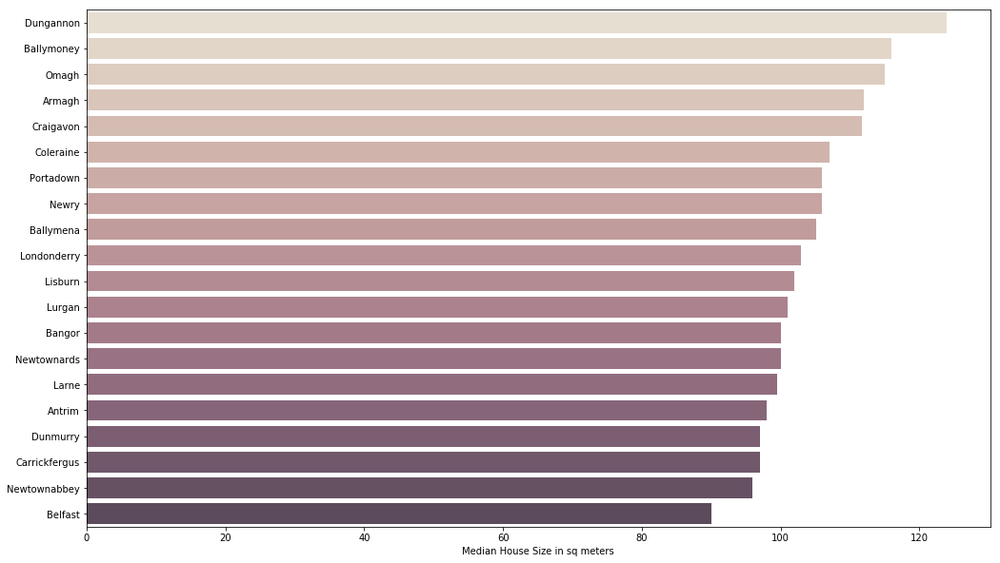
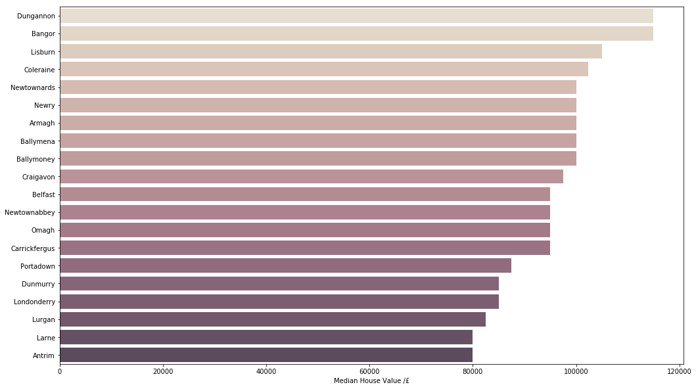
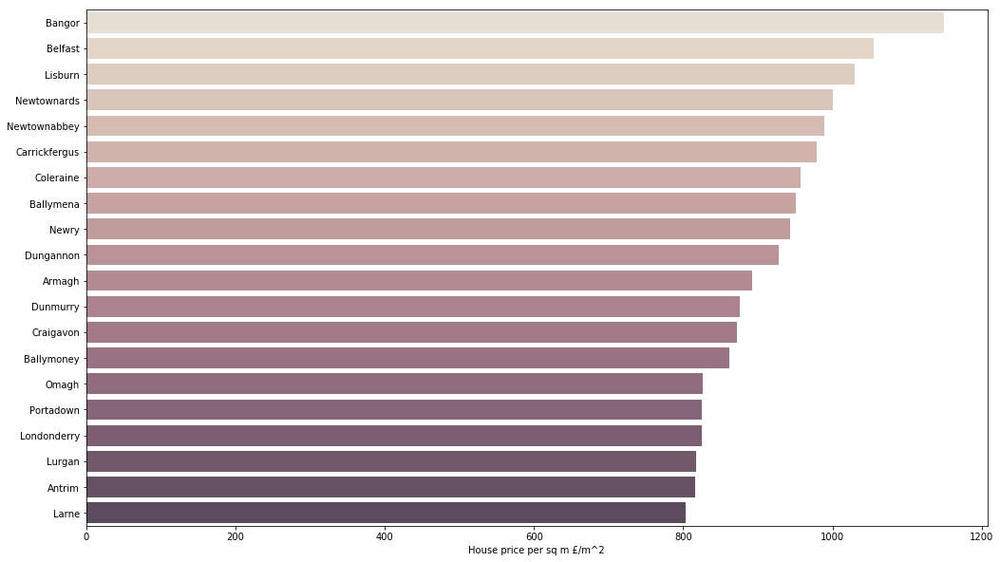
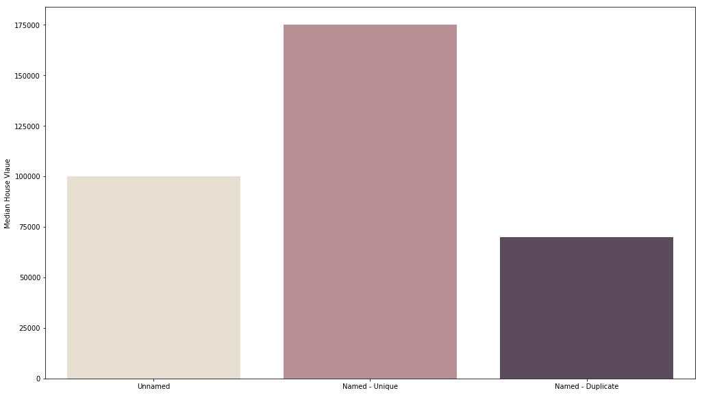
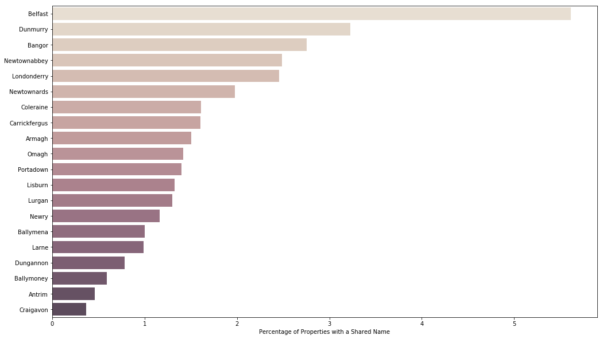
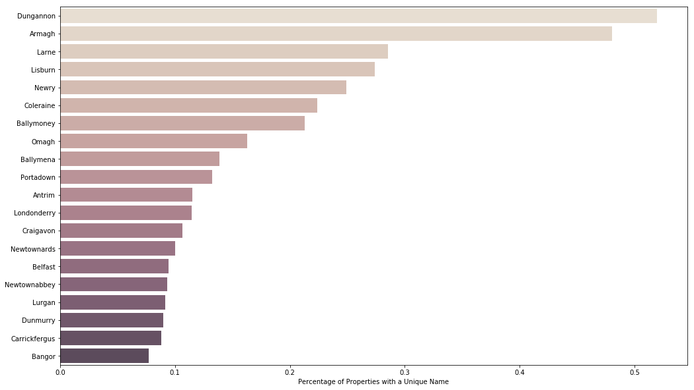
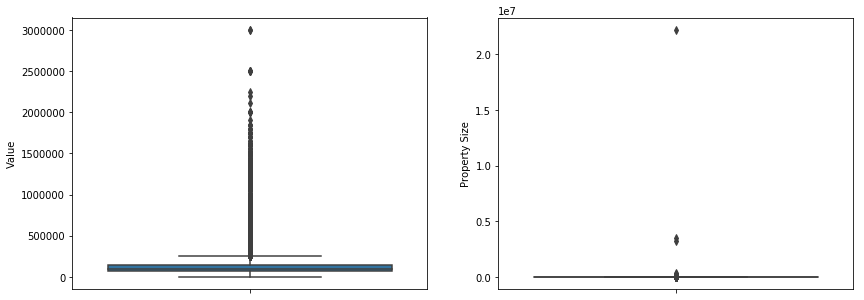

<h1><a name="title" href="#title">Northern Ireland Domestic Property Value Data <br>Initial Exploration</a></h1>

The Land and Property Service NI keeps a searchable dataset of all the domestic properties in Northern Ireland with details needed for determining the payable rates. This dataset looks interesting to explore with lots of possibilities for linking other data using the addresses of the properties.


<h1><a name="Contents" href="#Contents">Contents</a></h1>


1. [Loading the Data](#Loading-the-Data)
2. [Exploring the Data](#Exploring-the-Data)
  1. [House Size by Town](#House-Size-by-Town)
  2. [House Value by Town](#House-Value-by-Town)
  3. [House Value per m<sup>2</sup>by Town](#House-Value-per-m2-by-Town)
  4. [Named Properties](#Named-Properties)
  5. [Comparing House Value and Property Size](#Comparing-House-Value-and-Property-Size)
<p></p>

<h1><a name="Loading-the-Data" href="#Loading-the-Data">Loading the Data</a></h1>
<a href="#title">Back to top</a>

Loading in from the cleaned csv created in the previous post


```python
import pandas as pd
import numpy as np

properties_df = pd.read_csv("DomesticPropertyValue 16 row cleaned.csv", index_col=0)
properties_df.head()
```


<div>
<style scoped>
    .dataframe tbody tr th:only-of-type {
        vertical-align: middle;
    }

    .dataframe tbody tr th {
        vertical-align: top;
    }

    .dataframe thead th {
        text-align: right;
    }
</style>
<table border="1" class="dataframe">
  <thead>
    <tr style="text-align: right;">
      <th></th>
      <th>District</th>
      <th>Ward</th>
      <th>Street</th>
      <th>Building Name</th>
      <th>Sub-building Name</th>
      <th>Building Number</th>
      <th>Townland</th>
      <th>Town</th>
      <th>County</th>
      <th>Postcode</th>
      <th>Property Address</th>
      <th>Description</th>
      <th>Capital Value Non-Exempt</th>
      <th>Capital Value Exempt</th>
      <th>Property Size</th>
      <th>Central Heating</th>
      <th>Garage</th>
    </tr>
  </thead>
  <tbody>
    <tr>
      <th>0</th>
      <td>Antrim and Newtownabbey Borough Council</td>
      <td>Abbey</td>
      <td>Abbeyglen Crescent</td>
      <td>NaN</td>
      <td>NaN</td>
      <td>1</td>
      <td>White Abbey</td>
      <td>Newtownabbey</td>
      <td>Antrim</td>
      <td>BT37 0TJ</td>
      <td>1 Abbeyglen Crescent, White Abbey, Newtownabbe...</td>
      <td>House Garden</td>
      <td>70000.0</td>
      <td>0.0</td>
      <td>107.00</td>
      <td>Yes</td>
      <td>No</td>
    </tr>
    <tr>
      <th>1</th>
      <td>Antrim and Newtownabbey Borough Council</td>
      <td>Abbey</td>
      <td>Abbeyglen Crescent</td>
      <td>NaN</td>
      <td>NaN</td>
      <td>3</td>
      <td>White Abbey</td>
      <td>Newtownabbey</td>
      <td>Antrim</td>
      <td>BT37 0TJ</td>
      <td>3 Abbeyglen Crescent, White Abbey, Newtownabbe...</td>
      <td>House Garden</td>
      <td>90000.0</td>
      <td>0.0</td>
      <td>154.95</td>
      <td>Yes</td>
      <td>No</td>
    </tr>
    <tr>
      <th>2</th>
      <td>Antrim and Newtownabbey Borough Council</td>
      <td>Abbey</td>
      <td>Abbeyglen Crescent</td>
      <td>NaN</td>
      <td>NaN</td>
      <td>2</td>
      <td>White Abbey</td>
      <td>Newtownabbey</td>
      <td>Antrim</td>
      <td>BT37 0TJ</td>
      <td>2 Abbeyglen Crescent, White Abbey, Newtownabbe...</td>
      <td>House Garden</td>
      <td>70000.0</td>
      <td>0.0</td>
      <td>103.00</td>
      <td>Yes</td>
      <td>No</td>
    </tr>
    <tr>
      <th>3</th>
      <td>Antrim and Newtownabbey Borough Council</td>
      <td>Abbey</td>
      <td>Abbeyglen Crescent</td>
      <td>NaN</td>
      <td>NaN</td>
      <td>4</td>
      <td>White Abbey</td>
      <td>Newtownabbey</td>
      <td>Antrim</td>
      <td>BT37 0TJ</td>
      <td>4 Abbeyglen Crescent, White Abbey, Newtownabbe...</td>
      <td>Flat (Ground Floor)</td>
      <td>42000.0</td>
      <td>0.0</td>
      <td>56.00</td>
      <td>Yes</td>
      <td>No</td>
    </tr>
    <tr>
      <th>4</th>
      <td>Antrim and Newtownabbey Borough Council</td>
      <td>Abbey</td>
      <td>Abbeyglen Crescent</td>
      <td>NaN</td>
      <td>NaN</td>
      <td>6</td>
      <td>White Abbey</td>
      <td>Newtownabbey</td>
      <td>Antrim</td>
      <td>BT37 0TJ</td>
      <td>6 Abbeyglen Crescent, White Abbey, Newtownabbe...</td>
      <td>Flat (1st Floor)</td>
      <td>42000.0</td>
      <td>0.0</td>
      <td>56.00</td>
      <td>Yes</td>
      <td>No</td>
    </tr>
  </tbody>
</table>
</div>


<h1><a name="Exploring-the-Data" href="#Exploring-the-Data">Exploring the Data</a></h1>
<a href="#title">Back to top</a>

Lets talk a little about the data columns before we dive any deeper, so we know what we are working with. Most are self explanatory but 'Capital Value Non-Exempt' and 'Capital Value Exempt' are a little less so. These are the value ofthe properties that are non-exempt and exempt for tax respectively. So all the non-exempt will be domestic houses and exempt will be churches, church halls etc. Let's rename those to 'Value' and 'Exempt Value' for easier reading


```python
properties_df = properties_df.rename(index=str, columns={"Capital Value Non-Exempt": "Value", "Capital Value Exempt": "Exempt Value"})
```

The first thing to look at is what we already think we know. I know which towns in NI are the biggest but it is a good starting point (and sanity check if things start going awry later) to look at things you already know. 


```python
import matplotlib.pyplot as plt
import seaborn as sns

town_count = properties_df["Town"].value_counts().head(20)

fig, axes = plt.subplots(figsize=(17,10))
sns.barplot(town_count.values, town_count.index, alpha=0.8, palette="ch:.25")
axes.set(ylabel="", xlabel="Total Properties")
```


    [Text(0, 0.5, ''), Text(0.5, 0, 'Total Properties')]


Unsurprisingly Belfast has the most domestic property, followed by Derry. I am a little surprised to see Belfast quite so far out in front though at almost 4x second place. I also didn't realsie Bangor and Newtonabbey were so far up the list and I'm surprised to see Newry so far down too. Checking [wikipedia](https://en.wikipedia.org/wiki/List_of_localities_in_Northern_Ireland_by_population) supports these numbers with population figures though Newry is 10 in population and 17th in domestic properties. Something to look into later maybe.

<h2><a name="House-Size-by-Town" href="#House-Size-by-Town">House Size by Town</a></h2>
<a href="#title">Back to top</a>

Now let's look at property size and values in towns. There are over 300 towns in the data so we'll limit to looking at just the biggest 20. Which town has the biggest and smallest houses? To minimize the effect of outliers we will use the median not the mean.


```python
biggest_towns = properties_df["Town"].isin(town_count.index)
avg_house_size = properties_df[biggest_towns].groupby("Town")["Property Size"].median()
avg_house_size = avg_house_size.sort_values(ascending=False)

fig, axes = plt.subplots(figsize=(17,10))
sns.barplot(avg_house_size.values, avg_house_size.index, alpha=0.8, palette="ch:.25")
axes.set(ylabel="", xlabel="Median House Size in sq meters")
```


    [Text(0, 0.5, ''), Text(0.5, 0, 'Median House Size in sq meters')]





Unsurprisingly the biggest towns/cities tend to have the smallest houses on average with Belfast the smallest of the set. Derry has done quite well for itself though coming in half way down the list instead of 2nd last.

<h2><a name="House-Value-by-Town" href="#House-Value-by-Town">House Value by Town</a></h2>
<a href="#title">Back to top</a>

Median house value is a little harder to call. I would expect Belfast to be the most expensive but it is likely to have lots of small chap houses too.


```python
avg_house_value = properties_df[biggest_towns].groupby("Town")["Value"].median()
avg_house_value = avg_house_value.sort_values(ascending=False)

fig, axes = plt.subplots(figsize=(17,10))
sns.barplot(avg_house_value.values, avg_house_value.index, alpha=0.8, palette="ch:.25")
axes.set(ylabel="", xlabel="Median House Value /£")
```


    [Text(0, 0.5, ''), Text(0.5, 0, 'Median House Value /£')]





Interesting to see Belfast solidly middle of the pack this time and Derry has fallen near the bottom. 

<h2><a name="House-Value-per-m2-by-Town" href="#House-Value-per-m2-by-Town">House Value per m<sup>2</sup>by Town</a></h2>
<a href="#title">Back to top</a>

More telling would be to combine the two values and get a median price per m<sup>2</sup> which would give a kind of desireability rating for the town/city.


```python
price_per_m2 = avg_house_value/avg_house_size
price_per_m2 = price_per_m2.sort_values(ascending=False)

fig, axes = plt.subplots(figsize=(17,10))
sns.barplot(price_per_m2.values, price_per_m2.index, alpha=0.8, palette="ch:.25")
axes.set(ylabel="", xlabel="House price per sq m £/m^2")
```


    [Text(0, 0.5, ''), Text(0.5, 0, 'House price per sq m £/m^2')]





So it looks like Bangor is the most desirable place to live in Northern Ireland, at least by this simple metric. It's a bit of a drop to Belfast but it is still in a respectable 2nd place. Comiserations to Larne, Antrim and Lurgan all the way at the bottom with less than 70% the price/m<sup>2</sup> of Bangor.

<h2><a name="Named-Properties" href="#Named-Properties">Named Properties</a></h2>
<a href="#title">Back to top</a>

19,921 properties (2.6%) are named, or in a named building. Are named properties more valuable? What does a building having a name mean? let's look a t a few and see.


```python
named_buildings = properties_df["Building Name"].notnull() & (properties_df["Exempt Value"] == 0)
properties_df[named_buildings]["Building Name"].sample(n=15)
```


    113522          SPAFIELD FOLD
    258498        ST. JOHNS CLOSE
    311729        SPRINGVALE FOLD
    255414     THE BASS BUILDINGS
    541885    CASTLE ISLAND COURT
    318995          LOCKSLEY LANE
    284213       CULLINGTREE FOLD
    268464      THE ROSS BUILDING
    304813     OLD EXCHANGE COURT
    515515              VALLYVIEW
    590214            HENRY COURT
    262557            JAMES COURT
    498265        RIVERVIEW HOUSE
    75164             RUGBY MANOR
    572524           PIPERS FIELD
    Name: Building Name, dtype: object


```python
properties_df[named_buildings]["Building Name"].describe()
```


    count       19684
    unique       2757
    top       THE ARC
    freq          474
    Name: Building Name, dtype: object


So of the 19,921 237 have tax exemption so are we will ignore those. But of the 19,684 remaining there are only 2757 unique names and the most common property name is "THE ARC" occurring 474 times. Further investigation shows that "THE ARC" the name of a large apartment complex in the Titaic Quarter in Belfast. So there are some subsets of data here, uniquely named properties and properties in large complexes. 

We should compare the median price of unnamed properties to uniquely named and non uniquely named properties. Also which town names their properties the most?


```python
unique_names = properties_df["Building Name"].value_counts() == 1
duplicate_names = unique_names[~unique_names].index.values
unique_names = unique_names[unique_names].index.values

unique = properties_df["Building Name"].isin(unique_names)
duplicate = properties_df["Building Name"].isin(duplicate_names)

named_unnamed_value = pd.Series([properties_df[~named_buildings]["Value"].median(),
                                 properties_df[unique]["Value"].median(), 
                                 properties_df[duplicate]["Value"].median()], 
                                 index =['Unnamed','Named - Unique','Named - Duplicate'])
```


```python
fig, axes = plt.subplots(figsize=(17,10))
sns.barplot(named_unnamed_value.index, named_unnamed_value.values, alpha=0.8, palette="ch:.25")
axes.set(ylabel="Median House Vlaue", xlabel="")
```


    [Text(0, 0.5, 'Median House Vlaue'), Text(0.5, 0, '')]





So as you might expect the uniquely named properties are significantly more valuable than the unnamed or non uniquely named. It makes sense that the non uniquely named are lower in value as they are appartments in larger buildings. It also makes sense, to me at any rate, that the rich are more likely to name their houses, just seems like the kind of thing that they do.

Finally which town has the highest percentage of named properties?


```python
pct_duplicate_named = properties_df[biggest_towns].groupby("Town")["Building Name"].apply(lambda x: x.isin(duplicate_names).mean() * 100)
pct_duplicate_named = pct_duplicate_named.sort_values(ascending=False)

fig, axes = plt.subplots(figsize=(17,10))
sns.barplot(pct_duplicate_named.values, pct_duplicate_named.index, alpha=0.8, palette="ch:.25")
axes.set(ylabel="", xlabel="Percentage of Properties with a Shared Name")
```


    [Text(0, 0.5, ''), Text(0.5, 0, 'Percentage of Properties with a Shared Name')]





```python
pct_unique_named = properties_df[biggest_towns].groupby("Town")["Building Name"].apply(lambda x: x.isin(unique_names).mean() * 100)
pct_unique_named = pct_unique_named.sort_values(ascending=False)

fig, axes = plt.subplots(figsize=(17,10))
sns.barplot(pct_unique_named.values, pct_unique_named.index, alpha=0.8, palette="ch:.25")
axes.set(ylabel="", xlabel="Percentage of Properties with a Unique Name")
```


    [Text(0, 0.5, ''), Text(0.5, 0, 'Percentage of Properties with a Unique Name')]





Looking at the two graphs above we can see that the biggest towns tend to have the most properties with a shared building name as the will have the most appartment buildings. Interestingly although Dungannon has the most uniquely named properties Bangor has the least and they topped the list of median house value. So it turns out bangor might be a pretty great place to live, it has the highest house value per square meter and has the least pretentious people naming their houses. [Also you get the occassional amazing concert from all your homegrown musical talent.](https://www.belfasttelegraph.co.uk/entertainment/music/bono-and-friends-give-coldstricken-lightbody-night-to-remember-as-snow-patrol-stun-ward-park-concert-goers-38149440.html)

<h2><a name="Comparing-House-Value-and-Property-Size" href="#Comparing-House-Value-and-Property-Size">Comparing House Value and Property Size</a></h2>
<a href="#title">Back to top</a>

Let's look at the 2 most interesting columns, value and property size. We want to just look at domestic properties so filter for only those with an exempt value of 0.


```python
value_rows = (properties_df['Exempt Value'] == 0)
size_rows = value_rows & properties_df['Property Size'].notnull() & (properties_df['Property Size'] > 0)

f, axes = plt.subplots(1, 2, figsize=(14, 5))
sns.boxplot(y= properties_df[value_rows]['Value'], ax=axes[0])
sns.boxplot(y= properties_df[size_rows]['Property Size'], ax=axes[1])
```


    <matplotlib.axes._subplots.AxesSubplot at 0x2a029c69c88>





Unsurprisingly there are some outliers. The value outliers seem reasonable, I can imagine there is a house in Northern Ireland valued at £3,000,000 (though I wonder if they know they are paying the highest rates in the country?). I have difficulty imagining on the other hand that there are any properties in Northern Ireland that are 22 km<sup>2</sup>. We won't overwrite this data as it might be interesting to look at at some point but instead we can filter it out. Also lets use violin plots instead of box plots so we can see the shape of the data better with the probability density.


```python

value_rows = (properties_df['Exempt Value'] == 0) & (properties_df['Value'] < 1000000)
size_rows = value_rows & (~properties_df['Property Size'].isnull()) & (properties_df['Property Size'] > 0)
size_rows = size_rows & (properties_df['Property Size'] < 1000)

f, axes = plt.subplots(1, 2, figsize=(14, 5))
sns.violinplot(y= properties_df[value_rows]['Value'], ax=axes[0])
sns.violinplot(y= properties_df[size_rows]['Property Size'], ax=axes[1])
```

    C:\Users\Kevin\Anaconda3\envs\CSC3062\lib\site-packages\scipy\stats\stats.py:1713: FutureWarning: Using a non-tuple sequence for multidimensional indexing is deprecated; use `arr[tuple(seq)]` instead of `arr[seq]`. In the future this will be interpreted as an array index, `arr[np.array(seq)]`, which will result either in an error or a different result.
      return np.add.reduce(sorted[indexer] * weights, axis=axis) / sumval
    


    <matplotlib.axes._subplots.AxesSubplot at 0x2a02a8fdb00>


These plots are quite interesting but nothing too unexpected. As expeted the vast majority of properties are in a relatively small range of values and sizes with a very long thing tail to the super expensive, very large properties that are very rare.

One insteresting detail is the blob on the bottom of the Value distribution. Let's look at the description of those very cheap properties to see what they are.


```python
properties_df[properties_df['Value'] < 2000]['Description'].unique()
```


    array(['Outbuilding', 'O/Closed/', 'Store', 'House (Caravan)', 'O.',
           'Outbuildings', 'Lock-up Garage', 'O & Y', 'Outbuilding Yard',
           'Caravan', 'Garage', 'House (Mobile)', 'H Caravan Ag', 'Stores',
           'Outbuilding (Closed)', 'Boat House', 'Alms Houses'], dtype=object)


It looks like that cluster of cheaper properties are outbuildings, caravans, garages etc which seems reasonable.


