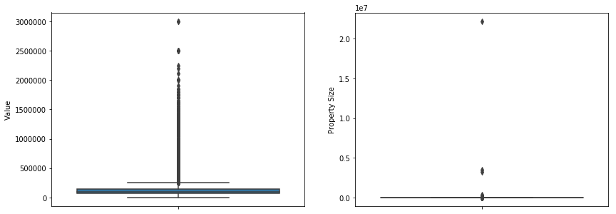
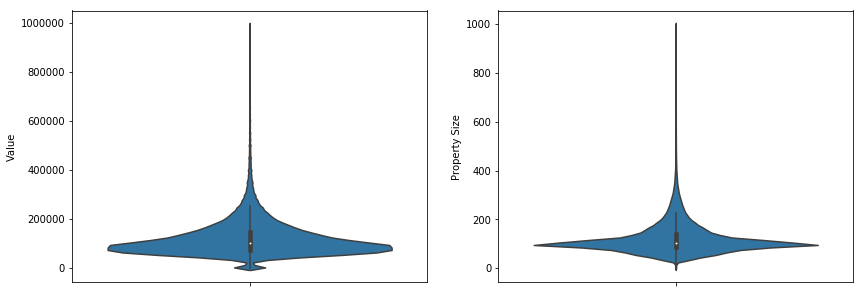

<h1><a name="title" href="#title">Northern Ireland Domestic Property Value Data</a></h1>

The Land and Property Service NI keeps a searchable dataset of all the domestic properties in Northern Ireland with details needed for determining the payable rates. This dataset looks interesting to explore with lots of possibilities for linking other data using the addresses of the properties.


# Loading the Data

We don't need everything in the dataset, such as district/ward/street IDs so only loading in specific columns


```python
import pandas as pd
import numpy as np
NI_domestic_properties = "DomesticPropertyValue.csv"

column_types = {'District': object, 'Ward': object, 'Street': object, 'Building Name': object, 
                'Sub-building Name': object, 'Building Number': object, 'Townland': object, 
                'Town': object, 'County': object, 'Postcode': object, 'Description': object, 
                'Capital Value Non-Exempt': object, 'Capital Value Exempt': object, 
                'Property Size': object, 'Central Heating': object, 'Garage': object,
                'Property Address': object}

properties_df = pd.read_csv(NI_domestic_properties, dtype=column_types, usecols=column_types.keys())
properties_df.head()
```


<div>
<style scoped>
    .dataframe tbody tr th:only-of-type {
        vertical-align: middle;
    }

    .dataframe tbody tr th {
        vertical-align: top;
    }

    .dataframe thead th {
        text-align: right;
    }
</style>
<table border="1" class="dataframe">
  <thead>
    <tr style="text-align: right;">
      <th></th>
      <th>District</th>
      <th>Ward</th>
      <th>Street</th>
      <th>Building Name</th>
      <th>Sub-building Name</th>
      <th>Building Number</th>
      <th>Townland</th>
      <th>Town</th>
      <th>County</th>
      <th>Postcode</th>
      <th>Property Address</th>
      <th>Description</th>
      <th>Capital Value Non-Exempt</th>
      <th>Capital Value Exempt</th>
      <th>Property Size</th>
      <th>Central Heating</th>
      <th>Garage</th>
    </tr>
  </thead>
  <tbody>
    <tr>
      <th>0</th>
      <td>Antrim and Newtownabbey Borough Council</td>
      <td>Abbey</td>
      <td>Abbeyglen Crescent</td>
      <td>NaN</td>
      <td>NaN</td>
      <td>1</td>
      <td>White Abbey</td>
      <td>Newtownabbey</td>
      <td>ANTRIM</td>
      <td>BT37 0TJ</td>
      <td>1 Abbeyglen Crescent, White Abbey, Newtownabbe...</td>
      <td>House Garden</td>
      <td>70,000.00</td>
      <td>0.00</td>
      <td>107.00 Square Metres</td>
      <td>Yes</td>
      <td>No</td>
    </tr>
    <tr>
      <th>1</th>
      <td>Antrim and Newtownabbey Borough Council</td>
      <td>Abbey</td>
      <td>Abbeyglen Crescent</td>
      <td>NaN</td>
      <td>NaN</td>
      <td>3</td>
      <td>White Abbey</td>
      <td>Newtownabbey</td>
      <td>ANTRIM</td>
      <td>BT37 0TJ</td>
      <td>3 Abbeyglen Crescent, White Abbey, Newtownabbe...</td>
      <td>House Garden</td>
      <td>90,000.00</td>
      <td>0.00</td>
      <td>154.95 Square Metres</td>
      <td>Full</td>
      <td>No</td>
    </tr>
    <tr>
      <th>2</th>
      <td>Antrim and Newtownabbey Borough Council</td>
      <td>Abbey</td>
      <td>Abbeyglen Crescent</td>
      <td>NaN</td>
      <td>NaN</td>
      <td>2</td>
      <td>White Abbey</td>
      <td>Newtownabbey</td>
      <td>ANTRIM</td>
      <td>BT37 0TJ</td>
      <td>2 Abbeyglen Crescent, White Abbey, Newtownabbe...</td>
      <td>House Garden</td>
      <td>70,000.00</td>
      <td>0.00</td>
      <td>103.00 Square Metres</td>
      <td>Yes</td>
      <td>No</td>
    </tr>
    <tr>
      <th>3</th>
      <td>Antrim and Newtownabbey Borough Council</td>
      <td>Abbey</td>
      <td>Abbeyglen Crescent</td>
      <td>NaN</td>
      <td>NaN</td>
      <td>4</td>
      <td>White Abbey</td>
      <td>Newtownabbey</td>
      <td>ANTRIM</td>
      <td>BT37 0TJ</td>
      <td>4 Abbeyglen Crescent, White Abbey, Newtownabbe...</td>
      <td>Flat (Ground Floor)</td>
      <td>42,000.00</td>
      <td>0.00</td>
      <td>56.00 Square Metres</td>
      <td>Yes</td>
      <td>No</td>
    </tr>
    <tr>
      <th>4</th>
      <td>Antrim and Newtownabbey Borough Council</td>
      <td>Abbey</td>
      <td>Abbeyglen Crescent</td>
      <td>NaN</td>
      <td>NaN</td>
      <td>6</td>
      <td>White Abbey</td>
      <td>Newtownabbey</td>
      <td>ANTRIM</td>
      <td>BT37 0TJ</td>
      <td>6 Abbeyglen Crescent, White Abbey, Newtownabbe...</td>
      <td>Flat (1st Floor)</td>
      <td>42,000.00</td>
      <td>0.00</td>
      <td>56.00 Square Metres</td>
      <td>Yes</td>
      <td>No</td>
    </tr>
  </tbody>
</table>
</div>


# Clean Up

Straight away there are some issues evident in the top 5 rows. Property size should be a number but includes the text "square meters". Building Name and Sub-building Name are NaN are they all NaN? What is the difference between "Full" central heating and marked "Yes". Capital Value Non-Exempt has a comma in it so won't be treated as numeric.

There are probably lots of other errors in the rest of the columns that need fixed that isn't evident in the top 5 rows. Time to dig further

### Look at the data
The first thing to do is look at the shape of the data. How many rows are we working with? Number of unique values in each column? Number of nulls? What do we expect for these values?


```python
print("Dataset shape: " + str(properties_df.shape))
for item in properties_df.columns:
    print('{:24}  {:6} {}'.format(str(item),  properties_df[item].nunique(), properties_df[item].dtype))
```

    Dataset shape: (766350, 17)
    District                      11 object
    Ward                         432 object
    Street                     22472 object
    Building Name               2881 object
    Sub-building Name           3021 object
    Building Number             3988 object
    Townland                    7507 object
    Town                         419 object
    County                        12 object
    Postcode                   41402 object
    Property Address          763885 object
    Description                 6494 object
    Capital Value Non-Exempt     654 object
    Capital Value Exempt         128 object
    Property Size              23077 object
    Central Heating                7 object
    Garage                         4 object
    

So we have 766350 rows of 16 columns, seems about right for every house in Northern Ireland. There should be 76,6350 unique addresses too but there are 2,465‬ too few probably missing.

11 districts, 432 wards, 22472 streets. I know the districts is correct and the others look about right, though these will only be wards and streets with houses on them.

My knowledge of NI geography isn't great but I'm pretty sure there aren't 12 counties, so that will need furthar investigation.

And why are there 7 options for central heating and 4 for whether the property has a garage?


### Investigating NI's 6 new counties


```python
properties_df["County"].unique()
```


    array(['ANTRIM', 'Antrim', nan, 'DOWN', 'Down', 'ARMAGH', 'Armagh',
           'LONDONDERRY', 'Londonderry', 'TYRONE', 'Tyrone', 'FERMANAGH',
           'Fermanagh'], dtype=object)


So unsurprisingly the data is inconsistent with its capitalisation. lets fix that.


```python
properties_df['County'] = properties_df['County'].apply(lambda x: str(x).upper().capitalize())
properties_df['County'] = properties_df['County'].replace('Nan', np.nan)
properties_df["County"].unique()
```


    array(['Antrim', nan, 'Down', 'Armagh', 'Londonderry', 'Tyrone',
           'Fermanagh'], dtype=object)


That is much better. It is likely that this is also a problem with the towns too.


```python
print("Unique towns before: " + str(properties_df["Town"].nunique()))
properties_df['Town'] = properties_df['Town'].apply(lambda x: str(x).upper().capitalize())
properties_df['Town'] = properties_df['Town'].replace('Nan', np.nan)
print("Unique towns after: " + str(properties_df["Town"].nunique()))
```

    Unique towns before: 419
    Unique towns after: 313
    

As expected that cleaned up the towns nicely too.

The last one that looks off is the central heating and the garage columns. They are small enough that we can look and the unique values directly.


```python
print("Central Heating: " + str(properties_df["Central Heating"].unique()))
print("Garage: " + str(properties_df["Garage"].unique()))
```

    Central Heating: ['Yes' 'Full' 'No' 'ASSUMED' 'Partial' 'None' nan 'FUL']
    Garage: ['No' 'NO' 'Yes' nan 'YES']
    

This time we have a mixture of capitalization, spelling errors and semingly duplicate categories. Let's make Garage just Yes/No and Central Heating to Yes/Assumed/Partial/No. Full and FUL can become Yes, None can be No.


```python
properties_df["Central Heating"] = properties_df["Central Heating"].str.replace("Full","Yes")
properties_df["Central Heating"] = properties_df["Central Heating"].str.replace("FUL","Yes")
properties_df["Central Heating"] = properties_df["Central Heating"].str.replace("None","No")
properties_df["Central Heating"] = properties_df["Central Heating"].str.replace("ASSUMED","Assumed")

properties_df['Garage'] = properties_df['Garage'].apply(lambda x: str(x).upper().capitalize())
properties_df['Garage'] = properties_df['Garage'].replace('Nan', np.nan)

print("Central Heating: " + str(properties_df["Central Heating"].unique()))
print("Garage: " + str(properties_df["Garage"].unique()))
```

    Central Heating: ['Yes' 'No' 'Assumed' 'Partial' nan]
    Garage: ['No' 'Yes' nan]
    


Looking back at the table of unique values per column we also printed the data type. Most are objects as expected for strings but Capital Value Non-Exempt, Capital Value Exempt and Property Size should all be numeric. Lets fix that. First the commas in the numbers need removed and " Square Metres" needs dropped from the property size column. Then they can be converted to numeric.


```python
properties_df["Capital Value Non-Exempt"] = properties_df["Capital Value Non-Exempt"].str.replace(",","")
properties_df["Capital Value Exempt"] = properties_df["Capital Value Exempt"].str.replace(",","")
properties_df["Property Size"] = properties_df["Property Size"].str.replace(",","")
properties_df["Property Size"] = properties_df["Property Size"].str.replace(" Square Metres","")

properties_df["Capital Value Non-Exempt"] = pd.to_numeric(properties_df["Capital Value Non-Exempt"])
properties_df["Capital Value Exempt"] = pd.to_numeric(properties_df["Capital Value Exempt"])
properties_df["Property Size"] = pd.to_numeric(properties_df["Property Size"])
```

### Looking at missing data and what can be fixed

Next we want to look at what data is missing. How many empty cells does each column have, which columns does that matter in and can we fix it?

Below the type of each column is listed along with the numer of nulls in each


```python
for item in properties_df.columns:
    print('{:24}  {:6}'.format(str(item),  properties_df[item].isnull().sum()))
    #print (item, ":\t", NI_dom_prop_df[item].isnull().sum(), "\t", NI_dom_prop_df[item].dtype)
```

    District                       0
    Ward                           0
    Street                         0
    Building Name             746429
    Sub-building Name         720583
    Building Number             7639
    Townland                     251
    Town                       16102
    County                      2003
    Postcode                   52182
    Property Address            1897
    Description                  165
    Capital Value Non-Exempt       0
    Capital Value Exempt           0
    Property Size                621
    Central Heating              839
    Garage                       841
    

There are quite a few values missing but for some columns such as Building Name and Sub-building Name that doesn't matter, it is to be expected. 52182 postcodes are missing though and I plan to use the postcodes for joining other data later. Fortunately we also have the full address which may have the postcode and there are only 1897 of those missing.

First lets get all the rows where the postcode is missing.


```python
rows_to_fix = properties_df["Postcode"].isnull()
```

Now lets look at a few addresses to see if they follow the same pattern. We will use sample here instead of head so we get a more representative view of the data


```python
pd.set_option('display.max_colwidth', -1)
print(properties_df[rows_to_fix]["Property Address"].sample(n=15))
#reset the max_colwidth to default
pd.set_option('display.max_colwidth', 50)
```

    65749     2 Bellevue, Ballyholme, Bangor BT20 5QJ,                                        
    537729    8 Drumgoon Road, Drumgoon, Maguiresbridge, Enniskillen BT94 4PB,                
    481941    15 Drumlegagh Road North, Largybeg, Newtownstewart, Omagh BT78 4HD,             
    222026    69 Northwick Drive, Edenderry, Belfast BT14 7NJ,                                
    722410    78 Main Street, Calmore, Tobermore, Magherafelt BT45 5PR,                       
    431889    32 Irish Green Street, Newtown Limavady Alias Rathbrady Beg, Limavady BT49 9AE, 
    702376    5 Laghey Cottages, Laghey, Dungannon BT71 6RH,                                  
    163443    1 Barban Hill Terrace, Balleny, Dromore BT25 1TN,                               
    499246    11 Bridgend Park, Ballycolman, Strabane BT82 9FY,                               
    634044    Lock-Up Garage 8, N8 Garron Crescent, Antiville, Larne, Antrim,                 
    712558    51 Coalisland Road, Killybracky, Dungannon BT71 6LA,                            
    766162    10A New Road, Carrickastickan, Forkhill, Newry BT35 9RT,                        
    39543     Lock Up Garage 3, N1a Barna Square, White House, Newtownabbey, Antrim,          
    197661    Lock-Up Garage 2, N63 Lime Grove, Ballyblagh, Lurgan, Armagh,                   
    416871    1 Culbidagh Court, Culbidag, Ballymena BT44 0TJ,                                
    Name: Property Address, dtype: object
    

For those that have postcodes they seem to be always at the end of the address followed by a comma. Postcodes are annoying to work with as they aren't fixed length and can have a space or not a space. For this we will rely on the format of the address being relatively consistent and strip the postcode from the end then check it looks like a postcode rather than resorting to complex regex. At least I can count on all Northern Ireland postcodes starting with BT which is nice.


```python
# get the last 10 characters of the address
fixed_postcodes = properties_df[rows_to_fix]["Property Address"].str.slice(-10,-1)
fixed_postcodes.sample(n=5)
```


    728948    BT34 4RL,
    498679    BT82 8DQ,
    711775    BT71 6JN,
    108841    BT23 6PR,
    577088    BT29 4WR,
    Name: Property Address, dtype: object


```python
#replace commas and strip leading and trailing whitespace
fixed_postcodes = fixed_postcodes.str.replace(",", "").str.strip()
fixed_postcodes.sample(n=5)
```


    193121      Armagh
    492704    BT48 8TF
    678060    BT45 8RX
    473909    BT81 7UF
    158127    BT61 7QQ
    Name: Property Address, dtype: object


```python
# get only the rows that start with "BT" 
right_rows = fixed_postcodes.str.startswith('BT', na=False)
fixed_postcodes[~right_rows] = np.nan
fixed_postcodes.sample(n=5)
```


    713551         NaN
    673324    BT71 5AT
    146208    BT71 7HD
    155697    BT63 5FU
    304502     BT5 6LA
    Name: Property Address, dtype: object


```python
# add back into the dataframe
properties_df.loc[rows_to_fix, 'Postcode'] = fixed_postcodes
print("Number of missing postcodes: " + str(properties_df["Postcode"].isnull().sum()))
```

    Number of missing postcodes: 10623
    

10,623 are still missing but that is a big improvement. We can go a little further though. The nice thing about postcodes is that they are geographically clustered. Houses on the same street have the same postcode. So I can group the data by district, ward and street and then apply any postcode found to all that are missing one on that street.


```python
def setPostcode(group):
    # only modify if there are nan's but not all nan's
    if group["Postcode"].isnull().any() and not group["Postcode"].isnull().all():
        # find the first not null postcode
        group_postcode = group.loc[group["Postcode"].first_valid_index()]["Postcode"]
        # apply the group postcode to each with a null postcode
        properties_df.loc[group.index[group['Postcode'].isnull()], 'Postcode'] = group_postcode
    return group


properties_df.groupby(['District','Ward', "Street"]).apply(setPostcode)
print("Number of missing postcodes: " + str(properties_df["Postcode"].isnull().sum()))
```

    Number of missing postcodes: 218
    

Down to only 218 missing postcodes from 52,182. Not bad!

### Save to File

Save this to file so we don't have to run all this everytime we restart the kernel.


```python
properties_df.to_csv("DomesticPropertyValue 16 row cleaned.csv")
```

# Exploring the Data

Lets talk a little about the data columns before we dive any deeper, so we know what we are working with. Most are self explanatory but 'Capital Value Non-Exempt' and 'Capital Value Exempt' are a little less so. These are the value ofthe properties that are non-exempt and exempt for tax respectively. So all the non-exempt will be domestic houses and exempt will be churches, church halls etc. Let's rename those to 'Value' and 'Exempt Value' for easier reading


```python
properties_df = properties_df.rename(index=str, columns={"Capital Value Non-Exempt": "Value", "Capital Value Exempt": "Exempt Value"})
```

Let's look at the 2 most interesting columns, value and property size. We want to just look at domestic properties so filter for only those with an exempt value of 0.


```python
import matplotlib.pyplot as plt
import seaborn as sns

value_rows = (properties_df['Exempt Value'] == 0)
size_rows = value_rows & ~properties_df['Property Size'].isnull() & properties_df['Property Size'] > 0

f, axes = plt.subplots(1, 2, figsize=(14, 5))
sns.boxplot(y= properties_df[value_rows]['Value'], ax=axes[0])
sns.boxplot(y= properties_df[size_rows]['Property Size'], ax=axes[1])
```


    <matplotlib.axes._subplots.AxesSubplot at 0x2095134c470>





Unsurprisingly therre are some outliers. The value outliers seem reasonable, I can imagine there is a house in Northern Ireland valued at £3,000,000 (though I wonder if they know they are paying the highest rates in the country?). I have difficulty imagining on the other hand that there are any properties in Northern Ireland that are 22 km<sup>2</sup>. We won't overwrite this data as it might be interesting to look at at some point but instead we can filter it out. Also lets use violin plots instead of box plots so we can see the shape of the data better with the probability density.


```python

value_rows = (properties_df['Exempt Value'] == 0) & (properties_df['Value'] < 1000000)
size_rows = value_rows & (~properties_df['Property Size'].isnull()) & (properties_df['Property Size'] > 0)
size_rows = size_rows & (properties_df['Property Size'] < 1000)

f, axes = plt.subplots(1, 2, figsize=(14, 5))
sns.violinplot(y= properties_df[value_rows]['Value'], ax=axes[0])
sns.violinplot(y= properties_df[size_rows]['Property Size'], ax=axes[1])
```


    <matplotlib.axes._subplots.AxesSubplot at 0x20952a0b128>





These plots are quite interesting but nothing too unexpected. As expeted the vast majority of properties are in a relatively small range of values and sizes with a very long thing tail to the super expensive, very large properties that are very rare.

One insteresting detail is the blob on the bottom of the Value distribution. Let's look at the description of those very cheap properties to see what they are.


```python
properties_df[properties_df['Value'] < 2000]['Description'].unique()
```


    array(['Outbuilding', 'O/Closed/', 'Store', 'House (Caravan)', 'O.',
           'Outbuildings', 'Lock-up Garage', 'O & Y', 'Outbuilding Yard',
           'Caravan', 'Garage', 'House (Mobile)', 'H Caravan Ag', 'Stores',
           'Outbuilding (Closed)', 'Boat House', 'Alms Houses'], dtype=object)


It looks like that cluster of cheaper properties are outbuildings, caravans, garages etc which seems reasonable.