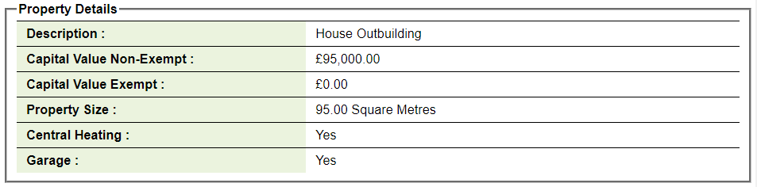

<h1><a name="title" href="#title">Northern Ireland Domestic Property Value Data</a></h1>

The Land and Property Service NI keeps a searchable dataset of all the domestic properties in Northern Ireland with details needed for determining the payable rates. This dataset looks interesting to explore with lots of possibilities for linking other data using the addresses of the properties.

I split my exploration into smaller categories for easier reading (be warned the posts can be quite long!) and to make it easier to add new sections if I come back to this in the future. Obviously it is all interesting but if care more about the destination than the journey skip down to section 4 that's where the good stuff is.

1. [Data Cleanup](NI_property_analysis_cleaning#title)

	Very important but not very interesting. Loading the raw data in and examining each column for mixed data types, inconsistent data entry (fixing capitalisation or spelling mistakes), making numeric columns actually numeric and looking at missing values and what can be done to fill them out.

2. [Initial Exploration](NI_property_analysis_initial_exploration#title)

	Diving into the cleaned data to see if there are any interesting discoveries near the surface.

3. [Joining new Data](NI_property_analysis_joining_data#title)

	Where real discoveries are made is where you can join multiple datasets together. This dataset postcodes which can be used to join a host of geographical information.

4. [Coming soon!](NI_property_analysis#title)

	